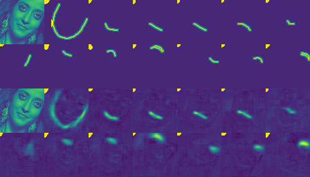

# 人脸关键点

### 实验的自变量：Hourglass的Block, 数据集以及Stage的数量

目前稳定的工作是：4个stage的residual block的hourglass可以正常跑通

## 数据集：
* 用newWflw里的数据增强（在原有时间上每个epoch会增加1min的时间）
* 先保存好了再跑（可能会使网络过拟合，当然可以通过数据集的图片数量解决）

## Train Boundary
* 建议使用循环Lr
* 除了看Loss的变换曲线，更加定性的方式是可视化boundary
* 目前每次400epoch

## Train Landmarks
* 暂时还没跑，不知道代码有没有问题
* 可以和boundary net一起训练，但后者需要很小的lr 或 不训练后者
* 这里使用SGD(momentum)比较好

